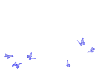

<h2> Hi, I'm Ana Carolina! </h2>

<em> Sistemas de Informação - <a href="https://www.uemg.br/">Universidade do Estado de Minas Gerais</a>
  Aprendiz de Desenvolvimento de Soluções tecnológicas - <a href="https://www.linkedin.com/company/cervejariacidadeimperial/"> Cervejaria Cidade Imperial</a></em>

---

### Linguagens e Ferramentas

 

 

### 🏆 GitHub Profile Trophy:

### ⚙️ GitHub Analytics
<table>
  <tr>
    <td>

    </td>
  <td>
    
 </td>
  </tr>
</table>

### 📈 GitHub Activity Graph:
 
